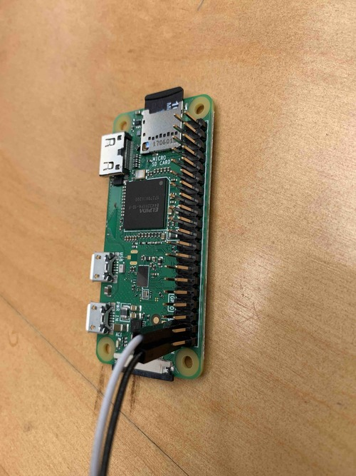
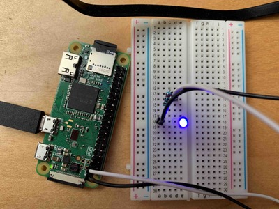

# Elixir Circuits Quickstart Firmware

[](https://circleci.com/gh/elixir-circuits/circuits_quickstart)

The goal of `circuits_quickstart` is to get nerves up and running on a supported device without the need for installing Erlang, Elixir, or any other Nerves dependencies. Within minutes, you'll have a device running Nerves. You'll be able to explore the Nerves utilities with [toolshed](https://hexdocs.pm/toolshed/0.2.0/api-reference.html), and you'll be able to control blinking LEDs from the device itself.

## Prerequisites

* 1 Device compatible with one of the firmware listed [here](https://github.com/elixir-circuits/circuits_quickstart/releases)
* [fwup](https://github.com/fhunleth/fwup) or [etcher](https://www.balena.io/etcher/)
* 1 MicroSD card
* 1 LED
* 1 100-500 Ohm resistor
* 1 breadboard
* 1 microUSB cable
* 2 male-to-female jumper cables

## Downloading the Firmware

Find the appropriate firmware or zip file [here](https://github.com/elixir-circuits/circuits_quickstart/releases). If you're using `fwup`, download the `.fw` extension and if you're using `etcher`, get the `zip` file.

Once that's done, you're ready to burn the firmware to an SD card.

## Burning the Firmware

Navigate to the directory where you downloaded the firmware. We'll go through both `fwup` and `etcher` methods.

To be clear, this formats your SD card, and you will *lose all data on the SD card*. Make sure you're OK with that.

### `fwup`

```console
λ ~/fwup circuits_quickstart_rpi0.fw
Use 15.84 GB memory card found at /dev/rdisk2? [y/N] y
```

Depending on your OS, you'll likely be asked to authenticate this action. Go ahead and do so.

```console
|====================================| 100% (31.81 / 31.81) MB
Success!
Elapsed time: 3.595 s
```

It's quite fast. Now you have Nerves ready to run on your device.  Skip ahead to the next section.

### `etcher`

Start `etcher`, point it to the zip file, and follow the prompts:


## Testing the Firmware

Eject the SD card and insert it into the device that you're using. Power up and connect the device with a USB cable. In the case of the `rpi0`, the micro USB does both.

Once the device boots, you can now connect to it. There are three ways to connect to the device: `ssh`, `picocom`, and distributed Erlang. We'll take a look at `ssh`.

### `ssh`

The `quickstart_circuits` project configures the user as `circuits` with the hose `nerves.local` and has the password set as `circuits`. With that in mind, we can use the `ssh` command to get to the `iex` prompt.

```console
λ ~/ ssh circuits@nerves.local
SSH server
Enter password for "circuits"
password:
Interactive Elixir (1.8.1) - press Ctrl+C to exit (type h() ENTER for help)
Toolshed imported. Run h(Toolshed) for more info

                ;kX'
              ,0XXXl
             xNXNNXX.
           'KNNXXXXX0.
          ;XNNNNNNNNN0.
         ;XNNNNNNNNNNNX:
        .XNNNXXXXXXXXXXXO.
        kNNNXNNNNXXNXXNNXNo
       .NNNXNNNNNXXNNXNNXXXO
       cXXXNNNNNNXXNNNNNNNNNd
       lNNNNNNNNNXXNXXXNNNNNK
       'NNXNXNXXXXXXXXXNNNNNk
        oNXNXXXXXNXXXNNNNXXX.
         :KXXXXXXNXXXNNNNXk.
           ;xXNXXXXNXXX0o.
              .',::;,.

      Elixir Circuits Quickstart

All of the Elixir Circuits projects are available in this firmware
image. See https://github.com/elixir-circuits/circuits_quickstart for
more details.

View log messages with `RingLogger.next` or `RingLogger.attach`. Toolshed
helpers are available. Type `h Toolshed` for details.

If connecting via ssh, type `exit` or `<enter>~.` to disconnect.

iex(circuits_quickstart@nerves.local)1>
```

In a matter of minutes, you have Nerves running on a device. As the text suggests, let's play around with `Toolshed` to see what's going on.  Run `h Toolshed` to see some of the helpers you can use. Let's take a look at a couple. `top` lists you the top processes in your system which can help in debugging and general system observability.

```elixir
iex(circuits_quickstart@nerves.local)3> top
Total processes: 165

Application  Name or PID                   Reds/Δ      Mbox/Δ     Total/Δ      Heap/Δ     Stack/Δ
undefined    erl_prim_loader               175K/175K      0/0       84K/84K     10K/10K       5/5
undefined    application_controller        153K/153K      0/0       73K/73K     28K/28K       7/7
undefined    <0.1048.0>=Elixir.IEx.Evalua   95K/95K       0/0       25K/25K    6772/6772    383/383
kernel       code_server                    88K/88K       0/0      220K/220K    28K/28K       3/3
ssh          <0.1043.0>=ssh_connection_ha   77K/77K       0/0       13K/13K    2586/2586     12/12
nerves_runti Elixir.Nerves.Runtime.KV       66K/66K       0/0       73K/73K     28K/28K      10/10
nerves_netwo Nerves.Network.Interface.usb   48K/48K       0/0       14K/14K    4185/4185     10/10
mdns         Elixir.Mdns.Server             38K/38K       0/0       17K/17K    6772/6772     10/10
system_regis Elixir.SystemRegistry.Proces   27K/27K       0/0      9358/9358   2586/2586     10/10
ssh          <0.1044.0>=ssh_client_channe   21K/21K       0/0       13K/13K    6772/6772     10/10
```

There are Linux system commands like `ls` as well.

```elixir
iex(circuits_quickstart@nerves.local)4> ls
lib          releases
```

Finally, since this is `iex` you can write Elixir code.

```elixir
iex(circuits_quickstart@nerves.local)5> defmodule A do
...(circuits_quickstart@nerves.local)5> def b, do: :hello
...(circuits_quickstart@nerves.local)5> end
{:module, A,
 <<70, 79, 82, 49, 0, 0, 3, 244, 66, 69, 65, 77, 65, 116, 85, 56, 0, 0, 0, 123,
   0, 0, 0, 14, 8, 69, 108, 105, 120, 105, 114, 46, 65, 8, 95, 95, 105, 110,
   102, 111, 95, 95, 7, 99, 111, 109, 112, ...>>, {:b, 0}}
iex(circuits_quickstart@nerves.local)6> A.b
:hello
```

Now we're going to take a slight detour and introduce the breadboard — first exit from `iex` with `exit` and return. Then, disconnect the RPI from the power source.

## Breadboard

At this point, we have Nerves running on a supported device, but there's no way to manipulate and LEDs because we currently have none connected. To connect an LED, we'll use a breadboard. If you're not sure or have never used a breadboard, SparkFun has a detailed [introduction](https://learn.sparkfun.com/tutorials/how-to-use-a-breadboard/all) (Sparkfun, by the way, is an excellent resource for electronics basics and components).

We'll give a high-level overview of what a breadboard is and how to use it here, too. Breadboards are useful for prototyping or creating temporary circuits; you can adjust connections and parts as needed without soldering. Soldering isn't difficult, but it's tedious and easy to damage components when desoldering.

The linked SparkFun article explains in detail how breadboards work, so for our purposes, we'll walk through creating a simple circuit to power an LED.

Insert the LED somewhere on the breadboard. Note that the longer leg of the LED is the positive side, and the shorter side is the negative side. Then take the resistor and bend the legs down as shown in the image. Insert the

The resistor impedes the electrical current so that it doesn't overload the LED.

Insert one of the jumper wires in the same row as the positive side of the LED and the other in the negative side of the LED. It doesn't matter which numbered row you use, ensure that the jumper wires line up as they do in the following image.


We're finished with the breadboard. You've almost created your first circuit. Let's close the circuit by attaching the jumper wires to the GPIO header pins on the device.

### Pinout.xyz

But which GPIO do you use? [Pinout.xyz](Pinout .xyz) holds the answer. Pinout lays out the GPIO for the Raspberry Pi. We need only two things: Broadcom pin number (BCM) and ground. The BCM is what controls the LED's status - on or off - and the ground grounds the circuit. You can see in the following diagram that the ground pins are colored black and the BCM pins we're interested in are colored green. There are other pins for power, UART, etc. and even BCM pins that serve specific functions; for now, know they exist but ignore them.


In the image, the last two pins on the bottom row on the right are what we need (you can choose another combination if you wish). Put the jumper wire that's attached on the negative end of the LED to the ground pin on the device. Next, connect the other jumper wire - the one connected to the positive leg of the LED - to BCM 26. The following image should help orient you.



## Flashing Lights

Now that we have everything wired up, let's try turning the light off and on. The first thing we'll do is `alias` `Circuits.GPIO` for convenience. If you're not familiar with `alias`, see the [guides](https://elixir-lang.org/getting-started/alias-require-and-import.html#alias).

```elixir
iex(circuits_quickstart@nerves.local)8> alias Circuits.GPIO
Circuits.GPIO
```

Next, we'll open `GPIO` `26`. That's the one we put the jumper wire that leads to the positive leg of the LED.

```elixir
iex(circuits_quickstart@nerves.local)9> GPIO.open(26, :output)
{:ok, #Reference<0.1415452060.268566532.135024>}
```

Since that returned as expected, we can now pattern match to the `ref`
and assign it to `led`. `v()` runs the last command again.

```elixir
iex(circuits_quickstart@nerves.local)10>  {:ok, led} = v()
{:ok, #Reference<0.1415452060.268566532.135024>}
```

Now we're ready to blink the light. Using `write/2`, we give the function the `ref` for the LED and `1` which turns the light on.

```elixir
iex(circuits_quickstart@nerves.local)11> GPIO.write(led, 1)
: OK
```

Now you should see the light illuminated.



To turn it off, use `write/2` again and pass in the same `ref` but this time with `0` to turn the light off.

```elixir
iex(circuits_quickstart@nerves.local)12> GPIO.write(led, 0)
:ok
```

That's about it. You've accomplished a great deal in not a lot of time.
